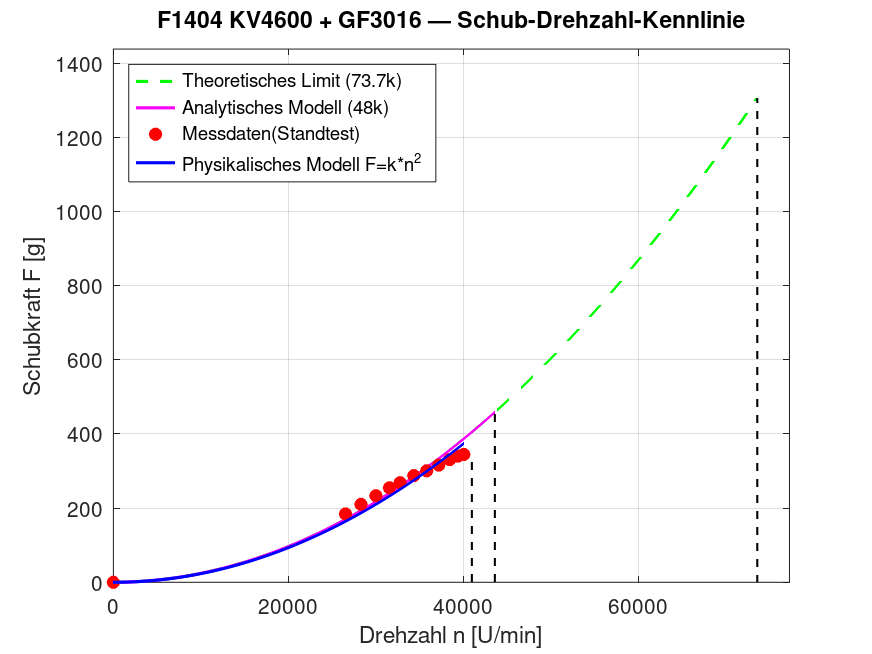
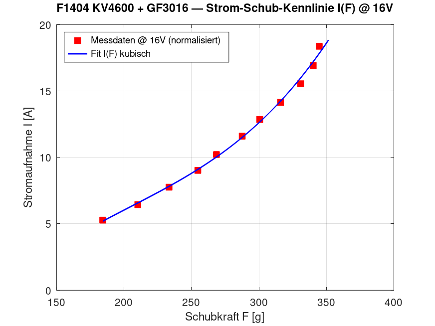
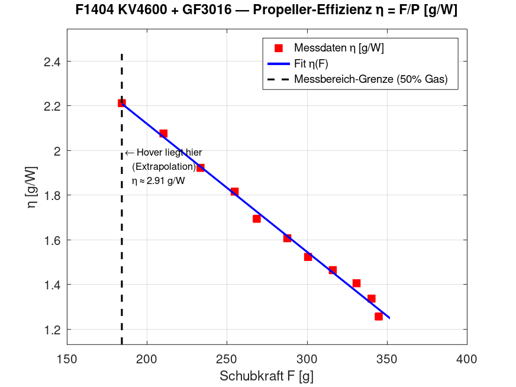

# Motormodell-Dokumentation — T-Motor F1404 KV4600

**Propeller:** GF3016  
**Quelle:** [n-factory.de Standtest-Datenblatt](https://n-factory.de/T-Motor-F1404-4600KV-Ultra-Light-Motor?)  
**Pipeline:** `motor_model.m` → `motor_lut.h` → `motor.cpp`

---

## 1. Ausgangsdaten (Standtest-Datenblatt)

Das Datenblatt liefert **11 Messpunkte** bei ~16V (4S LiPo), Umgebungstemperatur 8°C:

| Gas (%) | RPM    | Schub (g) | Spannung (V) | Strom (A) |
|---------|--------|-----------|--------------|-----------|
| 50      | 26 532 | 184,21    | 15,93        | 5,23      |
| 55      | 28 299 | 210,22    | 15,91        | 6,37      |
| 60      | 30 006 | 233,36    | 15,88        | 7,64      |
| 65      | 31 559 | 254,72    | 15,85        | 8,85      |
| 70      | 32 770 | 268,50    | 15,84        | 10,01     |
| 75      | 34 340 | 287,60    | 15,81        | 11,32     |
| 80      | 35 813 | 300,59    | 15,78        | 12,50     |
| 85      | 37 190 | 316,02    | 15,75        | 13,70     |
| 90      | 38 436 | 330,89    | 15,71        | 14,98     |
| 95      | 39 376 | 340,24    | 15,68        | 16,24     |
| 100     | 40 053 | 344,73    | 15,64        | 17,54     |

**Einschränkung:** Messungen nur im Bereich 50–100 % Gas. Die Tabelle wird durch einen erzwungenen Nullpunkt (0 %, 0 RPM, 0 A, 0 g Schub) ergänzt. Daraus werden **101 gleichmäßig verteilte Punkte** generiert (Schritt 0,01). Für eine 250-g-Drohne liegt der Schwebeflug-Gaspunkt bei ~18,4 % — dieser Bereich ist durch Extrapolation abgedeckt, aber nicht direkt gemessen.

---

## 2. Octave-Skript `motor_model.m` — Berechnungslogik

Das Skript führt alle physikalischen Berechnungen **einmalig offline** durch und speichert die Ergebnisse als fertige Tabellen in `motor_lut.h`. In `motor.cpp` gibt es keine Polynome mehr.

### Schritt 1 — Polynomregression (nur intern in Octave)

Aus den 12 Punkten (11 Standtest-Werte + erzwungener Nullpunkt) werden drei **Polynome 2. Grades** angepasst:

| Eingabe | Ausgabe | Octave-Aufruf |
|---------|---------|---------------|
| RPM | Schub [g] | `p_schub = polyfit(drehzahl_norm, schub_g, 2)` |
| Gas [0..1] | RPM | `p_rpm_fit = polyfit(gas_pct/100, drehzahl_norm, 2)` |
| Gas [0..1] | Strom [A] @ 16V | `strom_a_norm = strom_a .* (hover_v_nominal ./ spannung_v).^2` dann `p_strom = polyfit(gas_pct/100, strom_a_norm, 2)` |

Ergebnis für RPM→Schub:

|Koeffizient|Wert|
|---|---|
|$A$|$1{,}03911199 \times 10^{-7}$|
|$B$|$4{,}63501621 \times 10^{-3}$|
|$C$|$-8{,}33299713 \times 10^{-1}$|

**Mittlerer Fehler:** 0,904 g bei maximalem Schub 344,73 g → **3,2 %**

Da der erzwungene Nullpunkt eingeschlossen ist, öffnet die Parabel nach oben ($A > 0$). Die rechnerische Nullstelle liegt bei ~−44 785 RPM (negativ, physikalisch bedeutungslos).

**Die Koeffizienten A, B, C werden nicht in `motor_lut.h` exportiert** — sie werden nur im nächsten Schritt intern verwendet.

---

### Schritt 2 — Auswertung auf 101-Punkte-Tabellen

Alle drei Polynome werden auf einem gleichmäßigen Gitter mit **101 Punkten** (0,00–1,00, Schritt 0,01) ausgewertet:

```octave
gas_lut   = linspace(0, 1, 101);                            % MOTOR_TAB_GAS
rpm_lut   = max(0, polyval(p_rpm_fit, gas_lut));            % MOTOR_TAB_DREHZAHL
rpm_lut(1) = 0.0;                                           % Nullpunkt erzwingen
curr_lut  = max(MOTOR_I_IDLE, polyval(p_strom, gas_lut));  % MOTOR_TAB_STROM (@ 16V normalisiert)
schub_lut = max(0, polyval(p_schub, rpm_lut));              % MOTOR_TAB_SCHUB_N (@ 16V normalisiert)
```

`MOTOR_TAB_SCHUB` ist das **zentrale Ergebnis**: fertig berechnete Schubkraft [g] bei Nominalspannung (16 V) für jeden Gaspunkt. Die Zwischengröße RPM wird danach nicht mehr benötigt.

Lineare Interpolation zwischen benachbarten Punkten erfolgt zur Laufzeit in `motor.cpp`.

---

### Schritt 3 — Schwebeflug-Berechnung für 250-g-Drohne

Benötigter Schub pro Motor:

$$F_{hover} = \frac{250\,\text{g}}{4} = 62{,}5\,\text{g}$$

RPM beim Schwebeflug (Nullstelle des verschobenen Polynoms):

$$A \cdot RPM^2 + B \cdot RPM + (C - 62{,}5) = 0$$

$$RPM_{hover} = \frac{-B + \sqrt{B^2 - 4A(C - 62{,}5)}}{2A}$$

> **Hinweis zur Vorzeichenwahl:** Da $A > 0$ (nach oben geöffnete Parabel), liefert $+\sqrt{\ldots}$ den positiven, physikalisch sinnvollen Wurzel (~11 100 RPM nom.). Der andere Wurzel ($-\sqrt{\ldots}$) ist negativ und liegt außerhalb des Arbeitsbereichs.

Gas beim Schwebeflug:

$$throttle_{hover} = interp1(MOTOR\_TAB\_DREHZAHL,\, MOTOR\_TAB\_GAS,\, RPM_{hover}) \approx 17{,}7\,\%$$

Ergebnis wird als `MOTOR_HOVER_THROTTLE_250G` in `motor_lut.h` exportiert.

---

## 3. Berechnungsreihenfolge in `motor.cpp`

Keine Polynome, keine RPM-Berechnung — nur Tabellenzugriff.

```text
                     Eingang: throttle [0..1],  voltage [V]
                                      │
                                      ▼
                ┌─────────────────────────────────────────────┐
                │  tabInterp(throttle, MOTOR_TAB_SCHUB)     │
                │                                             │
                │  idx = throttle × 100   (O(1), kein Scan)   │
                │  lo = floor(idx),  hi = lo + 1              │
                │  α = idx − lo                               │
                │  schub_nom = TAB[lo] + α·(TAB[hi]−TAB[lo])  │
                └─────────────────────────────────────────────┘
                                      │
                                      ▼
                ┌─────────────────────────────────────────────┐
                │  Spannungsskalierung + Einheitenumrechnung  │
                │                                             │
                │       v = voltage / MOTOR_V_NOMINAL         │
                │       F[N] = max(0, schub_nom × v²)         │
                └─────────────────────────────────────────────┘
                                      │
                                      ▼
                           Ausgang: Schubkraft [N]
```

Analog für Strom (`MOTOR_TAB_STROM`, Skalierung mit $V^2$ — identisch zur Schubskalierung, da $I \propto \omega^2 \propto V^2$).

### Spannungsskalierung

| Größe | Physikalische Herleitung | Skalierung |
|--------|--------------------------|------------|
| RPM | $RPM \propto V$ (KV-Gesetz) | $\times V/V_{nom}$ |
| Schub | $F \propto RPM^2 \propto V^2$ | $\times (V/V_{nom})^2$ |
| Strom | $I \propto \omega^2 \propto V^2$ ($M_{prop} = c_P \omega^2$, $I = M/k_T$) | $\times (V/V_{nom})^2$ |

Gültig für ~13–19 V (Abweichung ±20 % vom Nominalwert). Tabellenwerte beziehen sich auf `MOTOR_V_NOMINAL = 16,0 V`.

---

## 4. Modellgrenzen

|Bereich|Qualität|
|---|---|
|50–100 % Gas|Gemessene Daten, mittlerer Fehler 3,2 %|
|0–49 % Gas|Polynomextrapolation — keine Standtest-Daten|
|Spannung|Gültig ~13–19 V ($V^2$ für Schub und Strom)|
|Temperaturabhängigkeit|Nicht modelliert|

---

## 5. Generierter Header `motor_lut.h`

Der Header wird **automatisch** von `motor_model.m` erzeugt und darf **nicht manuell bearbeitet** werden.

```text
motor_model.m  ──►  motor_lut.h  ──►  motor.cpp
  (Octave)          (auto-gen)        (C++)
```

Enthält:

- Elektrische Referenzparameter `MOTOR_V_NOMINAL`, `MOTOR_I_IDLE`
- Schwebeflug-Konstante `MOTOR_HOVER_THROTTLE_250G`
- `MOTOR_TAB_SIZE = 101`
- `MOTOR_TAB_GAS[101]` — gleichmäßiges Gitter 0,00–1,00
- `MOTOR_TAB_DREHZAHL[101]` — Drehzahl [RPM] bei 16 V
- `MOTOR_TAB_STROM[101]` — Strom [A] bei 16 V
- `MOTOR_TAB_SCHUB_N[101]` — Schubkraft [N] bei 16 V (Hauptausgang)
- `GRAMS_TO_NEWTONS` - Konstante für Einheitenumrechnung (g → N)

> Die Polynomkoeffizienten A, B, C existieren nur innerhalb von `motor_model.m` und werden nicht exportiert.

---

## 6. Grafiken aus `motor_model.m` zur Veranschaulichung der Anpassung und der resultierenden Tabellen:




